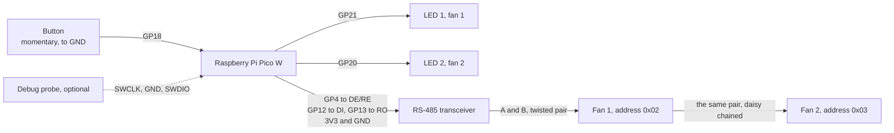

# Documentation

Not all of the information but I hope to write down most of it.

## Goal statement

Create a fan controller that is reliable and low power to control the fans for our house.
It has to be controllable manually through buttons or dials. Everything else like Homeassistant integration is optional. It is important that it works alone.

## Status LEDs
When the device powers on or after a restart it flashes both lights for a second to help spot eventually broken LEDs.
The status LEDs indicate the fans speed.
### Static LEDs
Both fans run at the same speed if the LEDs are not blinking.

| LED 1 | LED 2 | Status |
|-------|-------|---------------------------|
| Off | Off | Fan and/or controller off |
| On | Off | Fan speed low |
| Off | On | Fan speed medium |
| On | On | Fan speed max |

### Blinking LEDs

Both LEDs blink switching in a 250ms rythm at the start of the controller while the initial fan speed data is getting read from the fan.
Otherwise the LEDs only blink when they are running out of sync at different speeds.

LED 1 indicates fan 1 state.
LED 2 indicates fan 2 state.

If an LED is off, then the fan for that LED is off.
If the LED blinks once and then takes a 5 second break the fan for that LED runs at low speed. Two blinks for medium speed and three blinks for high speed.

> [!NOTE]
> Both LEDs might blink the same number of times. This means they still run at different speeds but within the same range for low, medium or high.

## Homeassistant integration

### 1. Join WiFi

The controller automatically joins the WiFi network that is configured.
The network name and passowrd is currently configured through environment variables at build/compile time and gets flashed onto the device. Plan is to make it configurable through a web interface. But there is no guarantee this will work out.

### 2. Homeassistant discovery

After successfully joining the network it tries to look up Homeassistant under the `homeassistant` name and tries to connect to it.
Homeassistant needs to have the MQTT broker installed as the controller uses MQTT to connect to homeassitant and send data between them.
After successful connection to the MQTT broker, the controller sends a discovery packet as defined by Homeassistant and the device should appear in Homeassistant on the dashboard when using the default Homeassistant configuration.

### 3. Sensors

Alongside the two fans the device announces five sensors per fan: speed in rpm, motor temperature,
electronics temperature, power draw in watts, and an energy counter in kWh. The fans are polled
every 30 seconds, starting 10 seconds after boot so the initial fan speed read has the bus to
itself.

The energy counter counts from when the fan left the factory and never resets, which is what lets
Homeassistant put it in the energy dashboard rather than only in a graph.

Speed shows as unknown until the controller has read the fan's configured maximum speed, which
every speed the fan reports is a fraction of. It retries that read on each poll, so a fan that was
unreachable at boot fills in on its own. The other four values do not depend on it and appear
right away.

## Wiring

Every pin the firmware uses is baked into the binary. There is no runtime configuration, so moving
a wire means editing the peripheral destructuring at the top of `main.rs` and flashing again.

### Pin assignment

| Pico pin | GPIO | Direction | Net | Wired to |
|---|---|---|---|---|
| 6 | GP4 | Output, idle low | `MODBUS_DE` | DE and RE on the transceiver, tied together |
| 16 | GP12 | UART0 TX | `MODBUS_TX` | DI |
| 17 | GP13 | UART0 RX | `MODBUS_RX` | RO |
| 24 | GP18 | Input, internal pull-up | `BUTTON` | One side of the button, the other side to GND |
| 26 | GP20 | Output, active high | `LED_2` | LED 2 anode through a series resistor, cathode to GND |
| 27 | GP21 | Output, active high | `LED_1` | LED 1 anode through a series resistor, cathode to GND |
| 36 | 3V3(OUT) | Supply out | `+3V3` | Transceiver VCC |
| 38 | GND | — | `GND` | Transceiver GND, LED cathodes, button, RS-485 common |
| On the module | GP23, GP24, GP25, GP29 | PIO0 + DMA0 | CYW43439 | Nothing. The Wi-Fi chip sits on the Pico W itself |

Pin numbers are physical positions on the board, GPIO numbers are what the firmware calls them.
Any of the eight ground pins will do; 38 is just the one nearest the signals on that side.

### RS-485 to the fans

The fans speak Modbus RTU on a two-wire bus, which is half duplex: the same pair carries the
request and the answer, so only one device may drive it at a time. GP4 is what arbitrates that. It
idles low, which leaves the transceiver receiving and the fans owning the line, and goes high only
for the few hundred microseconds a request takes.

> [!IMPORTANT]
> Use a transceiver rated for 3.3 V, such as a MAX3485 or an SN65HVD72. A real MAX485 is a 5 V
> part and its RO output would then swing to 5 V into GP13, which is not 5 V tolerant. Many of the
> cheap blue breakout boards sold as "MAX485 modules" are 5 V only.

- Wire it as a bus, not a star: one pair from the transceiver to fan 1, and on from fan 1 to fan 2.
- Terminate both ends with 120 Ω across A and B, one at the transceiver and one at the last fan,
  and nothing in between.
- A and B are a twisted pair, with a third conductor tying the fans' RS-485 common back to
  controller ground. A differential pair still needs both ends to agree where zero is.
- The fans have to be set to 19_200 baud, 8 data bits, even parity, 1 stop bit. Even parity in
  particular is easy to leave on the wrong setting.
- Addresses are set on the fans themselves: `0x02` for fan 1 and `0x03` for fan 2. `0x01` is
  skipped because it is a likely factory default.

When the frame has been written, `blocking_flush()` returns as soon as the software buffer is
empty, but the frame is still in the hardware FIFO and shift register rather than on the wire. So
`send_request` in `modbus/client.rs` spins on `uart.busy()` and only then drops GP4. Dropping it
early truncates the frame, the fan rejects it on the checksum, and the result looks exactly like a
fan that is not answering. The line has to be back in the fan's hands well within the 3.5
characters of silence it waits before replying, which is about 2 ms at this baud rate.

### Button

GP18 has the internal pull-up on and the firmware acts on the falling edge, so the switch just
shorts GP18 to ground and needs no external resistor. Debouncing is 250 ms in software, so a plain
momentary switch is enough and there is no need for an RC network.

### Status LED wiring

Both outputs are active high: the pin drives the anode through a series resistor and the cathode
goes to ground. Around 330 Ω gives a comfortable few milliamps at 3.3 V. LED 1 is GP21 and reports
fan 1, LED 2 is GP20 and reports fan 2 — crossing the two makes the blink patterns above describe
the wrong fan.

### Power

The Pico runs from USB or from a supply on VSYS, and the transceiver is the only thing hanging off
3V3(OUT). The fans have their own mains supply and none of it passes through this board; only the
RS-485 pair and its ground reference cross between the two.

### Debug probe

Optional and only for development: three wires to the SWD header on the bottom edge of the Pico W,
SWCLK, GND and SWDIO, from a debug probe or a second Pico running picoprobe. `cargo run` flashes
through it and the `defmt` logs come back over the same connection.

### What is convention rather than fixed

The GPIO column above is compiled in. The rest is ordinary practice and worth knowing as such:

- The resistor values, 330 Ω for the LEDs and 120 Ω for termination, are the usual starting points
  and were not measured for this build.
- Powering the transceiver from 3V3(OUT) assumes a 3.3 V part, as above.
- No isolation is shown. For a long run through the house an isolated transceiver is the more
  conservative build.
