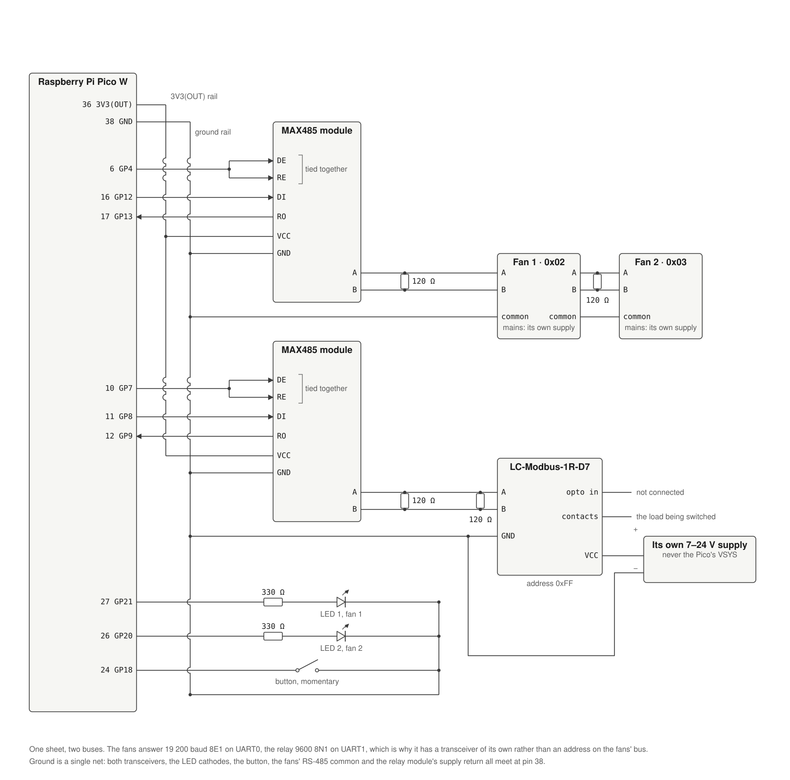
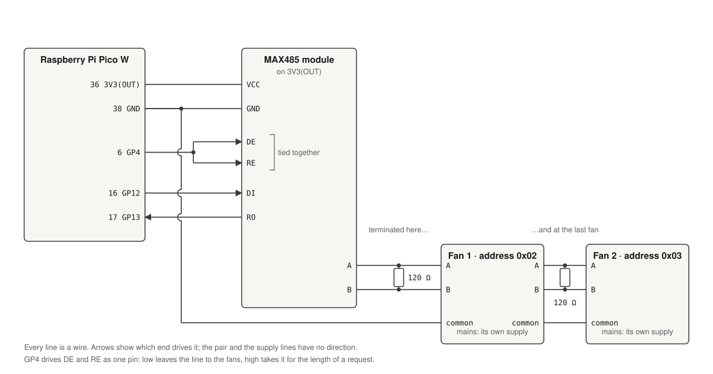
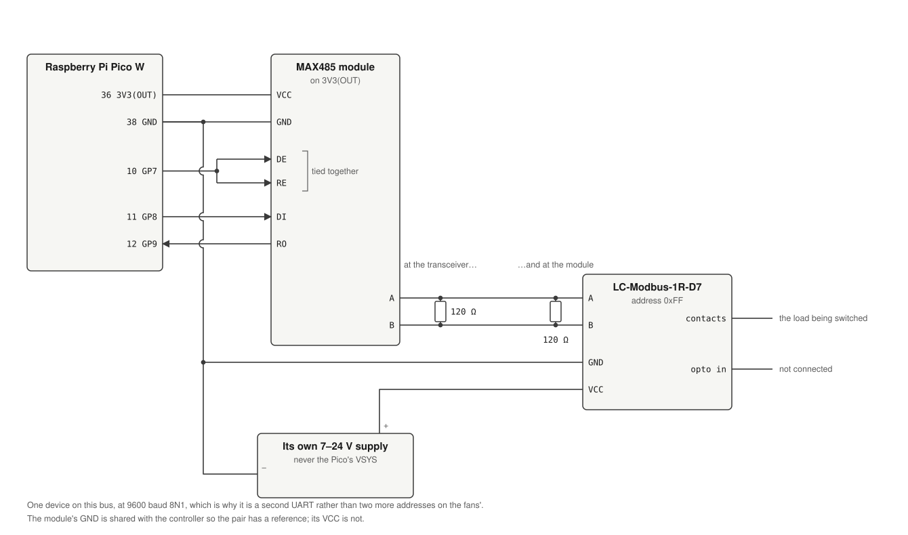
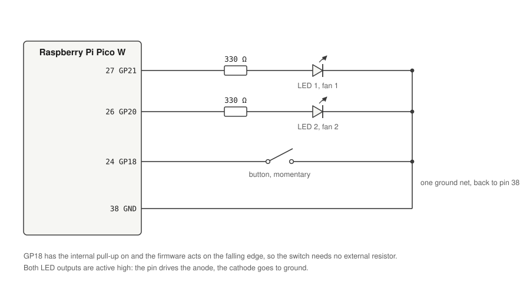

# Documentation

Not all of the information but I hope to write down most of it.

## Goal statement

Create a fan controller that is reliable and low power to control the fans for our house.
It has to be controllable manually through buttons or dials. Everything else like Homeassistant integration is optional. It is important that it works alone.

## Status LEDs
When the device powers on or after a restart it flashes both lights for a second to help spot eventually broken LEDs.
The status LEDs indicate the fans speed.
### Static LEDs
Both fans run at the same speed if the LEDs are not blinking.

| LED 1 | LED 2 | Status |
|-------|-------|---------------------------|
| Off | Off | Fan and/or controller off |
| On | Off | Fan speed low |
| Off | On | Fan speed medium |
| On | On | Fan speed max |

### Blinking LEDs

Both LEDs blink switching in a 250ms rythm at the start of the controller while the initial fan speed data is getting read from the fan.
Otherwise the LEDs only blink when they are running out of sync at different speeds.

LED 1 indicates fan 1 state.
LED 2 indicates fan 2 state.

If an LED is off, then the fan for that LED is off.
If the LED blinks once and then takes a 5 second break the fan for that LED runs at low speed. Two blinks for medium speed and three blinks for high speed.

> [!NOTE]
> Both LEDs might blink the same number of times. This means they still run at different speeds but within the same range for low, medium or high.

## Homeassistant integration

### 1. Join WiFi

The controller automatically joins the WiFi network that is configured.
The network name and passowrd is currently configured through environment variables at build/compile time and gets flashed onto the device. Plan is to make it configurable through a web interface. But there is no guarantee this will work out.

### 2. Homeassistant discovery

After successfully joining the network it tries to look up Homeassistant under the `homeassistant` name and tries to connect to it.
Homeassistant needs to have the MQTT broker installed as the controller uses MQTT to connect to homeassitant and send data between them.
After successful connection to the MQTT broker, the controller sends a discovery packet as defined by Homeassistant and the device should appear in Homeassistant on the dashboard when using the default Homeassistant configuration.

### 3. What is announced

Two fans, four sensors each, and one switch. The switch is the relay module on the second Modbus
bus: a plain contact, with no speed and nothing it measures.

Its state topic carries what the module confirmed rather than what it was asked for, which is the
rule the fans follow too. A write that is never acknowledged leaves the last confirmed state
standing in Home Assistant rather than showing a command as though it had taken effect, and the
contact is read back on boot, so a controller that restarts while the relay is closed says so
instead of assuming it is open. If the module cannot be reached at all the switch stays unknown,
which is the honest answer rather than a guess.

### 4. Sensors

Alongside the two fans the device announces four sensors per fan: speed in rpm, motor temperature,
electronics temperature, and power draw in watts. The fans are polled every 30 seconds, starting
10 seconds after boot so the initial fan speed read has the bus to itself.

There is deliberately no energy sensor. The Modbus specification documents a consumption counter in
kWh at `D029`/`D02A`, but both fans return `0xFFFF` for both registers, which is what an ebm-papst
fan reports for a register its hardware variant does not implement. Announcing it put a permanent
4 294 967 295 kWh in Homeassistant's energy dashboard, so the sensor was dropped rather than
published as a value that never becomes real.

Speed shows as unknown until the controller has read the fan's configured maximum speed, which
every speed the fan reports is a fraction of. It retries that read on each poll, so a fan that was
unreachable at boot fills in on its own. The other three values do not depend on it and appear
right away.

## Wiring

Every pin the firmware uses is baked into the binary. There is no runtime configuration, so moving
a wire means editing the peripheral destructuring at the top of `main.rs` and flashing again.

That is the whole thing on one sheet, down to the pin. It is a lot to take in at once, so
[Every pin, device by device](#every-pin-device-by-device) below draws the same wiring one bus
at a time, and the tables after it list every pin of every device, including the ones that stay
empty. A debug probe, when one is attached, is three more wires to the connector on the bottom
edge: SWCLK, GND and SWDIO.

### Pin assignment

| Pico pin | GPIO | Direction | Net | Wired to |
|---|---|---|---|---|
| 6 | GP4 | Output, idle low | `MODBUS_DE` | DE and RE on the transceiver, tied together |
| 16 | GP12 | UART0 TX | `MODBUS_TX` | DI |
| 17 | GP13 | UART0 RX | `MODBUS_RX` | RO |
| 10 | GP7 | Output, idle low | `RELAY_DE` | DE and RE on the second transceiver, tied together |
| 11 | GP8 | UART1 TX | `RELAY_TX` | DI on the second transceiver |
| 12 | GP9 | UART1 RX | `RELAY_RX` | RO on the second transceiver |
| 24 | GP18 | Input, internal pull-up | `BUTTON` | One side of the button, the other side to GND |
| 26 | GP20 | Output, active high | `LED_2` | LED 2 anode through a series resistor, cathode to GND |
| 27 | GP21 | Output, active high | `LED_1` | LED 1 anode through a series resistor, cathode to GND |
| 36 | 3V3(OUT) | Supply out | `+3V3` | Transceiver VCC |
| 38 | GND | — | `GND` | Transceiver GND, LED cathodes, button, RS-485 common, the relay module's supply ground |
| On the module | GP23, GP24, GP25, GP29 | PIO0 + DMA0 | CYW43439 | Nothing. The Wi-Fi chip sits on the Pico W itself |

Pin numbers are physical positions on the board, GPIO numbers are what the firmware calls them.
Any of the eight ground pins will do; 38 is just the one nearest the signals on that side.

GP8 and GP9 are not a preference. They are the only pair UART1 can use here: its other transmit
pins are GP4, which arbitrates the fans' bus, and GP20, which drives a status LED. GP0 and GP1 are
free but left alone, because that is where a debug probe's UART bridge is conventionally wired and
this build has no reason to take them.

### Every pin, device by device

The table above is the controller's side of each wire. This is the same wiring seen from every
device on the bench, including the pins that stay empty, so a board can be checked against it
without inferring anything. The sheet at the top of this section has all of it at once; these take
it one bus at a time.

The fans' bus. GP4 arbitrates it, UART0 carries it, and the two fans share one pair:

The relay's bus. The same shape on UART1, one device on it, and its own supply:

The button and the LEDs. No transceiver, and nothing shared but ground:

A dot is a junction and a hop is a crossing that is not one. Pin 38 carries two wires in the first
two pictures because ground is one net reached twice over: the transceiver needs it as a supply
return, and the far device needs it as the reference its differential pair is measured against. All
of it — the Pico's GND, both transceivers', the LED cathodes, the button, the fans' RS-485 common
and the relay module's supply ground — is the same net.

All four drawings are written by [wiring_diagram](../wiring_diagram), a workspace crate that takes
coordinates rather than SVG paths, so moving a wire is an edit to a number. It has no dependencies:
`cd wiring_diagram && cargo run`, then commit what it writes. `src/svg.rs` is the shapes, one
function each; `src/sheets.rs` is the four sheets, and is where a wire lives.

#### Raspberry Pi Pico W

All forty header pins, so an empty one is empty on purpose.

| Pin | Name | In this build |
|---|---|---|
| 1 | GP0 | Not connected. Left free for a debug probe's UART bridge |
| 2 | GP1 | Not connected. Same reason |
| 3 | GND | Not connected. Any ground pin will do; 38 is the one used |
| 4 | GP2 | Not connected |
| 5 | GP3 | Not connected |
| 6 | GP4 | `MODBUS_DE` → DE and RE on the fans' transceiver, tied together |
| 7 | GP5 | Not connected |
| 8 | GND | Not connected |
| 9 | GP6 | Not connected |
| 10 | GP7 | `RELAY_DE` → DE and RE on the relay's transceiver, tied together |
| 11 | GP8 | `RELAY_TX`, UART1 TX → DI on the relay's transceiver |
| 12 | GP9 | `RELAY_RX`, UART1 RX ← RO on the relay's transceiver |
| 13 | GND | Not connected |
| 14 | GP10 | Not connected |
| 15 | GP11 | Not connected |
| 16 | GP12 | `MODBUS_TX`, UART0 TX → DI on the fans' transceiver |
| 17 | GP13 | `MODBUS_RX`, UART0 RX ← RO on the fans' transceiver |
| 18 | GND | Not connected |
| 19 | GP14 | Not connected |
| 20 | GP15 | Not connected |
| 21 | GP16 | Not connected |
| 22 | GP17 | Not connected |
| 23 | GND | Not connected |
| 24 | GP18 | `BUTTON` → one terminal of the button, internal pull-up on |
| 25 | GP19 | Not connected |
| 26 | GP20 | `LED_2` → LED 2 anode through its series resistor |
| 27 | GP21 | `LED_1` → LED 1 anode through its series resistor |
| 28 | GND | Not connected |
| 29 | GP22 | Not connected |
| 30 | RUN | Not connected |
| 31 | GP26 / ADC0 | Not connected |
| 32 | GP27 / ADC1 | Not connected |
| 33 | AGND | Not connected |
| 34 | GP28 / ADC2 | Not connected |
| 35 | ADC_VREF | Not connected |
| 36 | 3V3(OUT) | `+3V3` → VCC on both transceivers |
| 37 | 3V3_EN | Not connected |
| 38 | GND | `GND` → the one ground net, everything below hangs off it |
| 39 | VSYS | Optionally the board's supply, if it is not run from USB. Not the relay module's |
| 40 | VBUS | Not connected |

Four GPIOs never reach the header at all: GP23, GP24, GP25 and GP29 are the Pico W's own wiring to
the CYW43439 radio, which the firmware drives through PIO0 and DMA_CH0. They are listed in
`main.rs` because the driver asks for them, not because anything is soldered to them.

The debug connector on the bottom edge is three more: SWCLK, GND and SWDIO, used only when a probe
is attached.

#### MAX485 module, both of them

The same eight pins on each board, wired to a different UART.

| Pin | Fans' module (GP4 / GP12 / GP13) | Relay module (GP7 / GP8 / GP9) |
|---|---|---|
| RO | Receiver out → GP13 | Receiver out → GP9 |
| RE | Receiver enable, active low. Tied to DE, both to GP4 | Tied to DE, both to GP7 |
| DE | Driver enable. Tied to RE, both to GP4 | Tied to RE, both to GP7 |
| DI | Driver in ← GP12 | Driver in ← GP8 |
| GND | The ground net | The ground net |
| A | Fan 1 A, and on to fan 2 A. 120 Ω to B here | Relay module A. 120 Ω to B here |
| B | Fan 1 B, and on to fan 2 B. 120 Ω to A here | Relay module B. 120 Ω to A here |
| VCC | 3V3(OUT), pin 36 | 3V3(OUT), pin 36 |

RE is active low and DE is active high, which is why tying them together works: one pin then means
*driving*, and its idle low state means *listening*. GP4 and GP7 idle low for that reason.

#### The fans

Two identical RadiCal units, daisy chained rather than each run back to the transceiver.

| Terminal | Fan 1, address 0x02 | Fan 2, address 0x03 |
|---|---|---|
| A | Transceiver A, and on to fan 2 A | Fan 1 A. 120 Ω to B, this is the far end of the bus |
| B | Transceiver B, and on to fan 2 B | Fan 1 B. 120 Ω to A |
| RS-485 common | Controller ground, and on to fan 2 | Fan 1's common |
| Mains | Its own supply. None of it passes through this board | Its own supply |

Both fans are set to 19_200 baud, 8E1, and to those two addresses, from the fans themselves rather
than from anything the controller sends.

> [!NOTE]
> A and B are printed on the fan's own terminal block, and RS-485 is famously inconsistent about
> which conductor is which. If a fan answers nothing at all with the settings right, swapping A and
> B at the fan is the first thing to try. `docs/manufacturer/radical/` is the authority on the
> terminal names and it is a private submodule, so check there rather than against this table if
> the two disagree.

#### The relay module

| Terminal | Wired to |
|---|---|
| A | Relay transceiver A. 120 Ω to B |
| B | Relay transceiver B. 120 Ω to A |
| VCC | Its own 7-24 V supply, **not** the Pico. See the note further down |
| GND | Its own supply's ground, tied to the controller ground so the bus has a reference |
| Relay contacts | Whatever is being switched. Nothing on this side reaches the controller |
| Opto input | Unused. The firmware reads only the coil |

#### Button and LEDs

| Part | Pin | Wired to |
|---|---|---|
| Button | Terminal 1 | GP18, pin 24 |
| Button | Terminal 2 | GND |
| LED 1, fan 1 | Anode | GP21, pin 27, through about 330 Ω |
| LED 1, fan 1 | Cathode | GND |
| LED 2, fan 2 | Anode | GP20, pin 26, through about 330 Ω |
| LED 2, fan 2 | Cathode | GND |

A four pin tactile switch is two terminals twice over: either of each diagonal pair.

### RS-485 to the fans

The fans speak Modbus RTU on a two-wire bus, which is half duplex: the same pair carries the
request and the answer, so only one device may drive it at a time. GP4 is what arbitrates that. It
idles low, which leaves the transceiver receiving and the fans owning the line, and goes high only
for the few hundred microseconds a request takes.

> [!IMPORTANT]
> This build uses the cheap blue MAX485 breakout modules, powered from 3V3(OUT) along with
> everything else on that rail. That is below the 4.75 V the MAX485 datasheet asks for, and it is
> deliberate: run at 5 V, the module's RO output swings to 5 V into GP13, which is not 5 V
> tolerant. Powering the transceiver from the same 3.3 V the Pico's pins work at keeps the logic
> levels inside what GP13 can take, at the price of running the part under its rated supply. A 5 V
> transceiver would need a divider or a level shifter on RO instead.

- Wire it as a bus, not a star: one pair from the transceiver to fan 1, and on from fan 1 to fan 2.
- Terminate both ends with 120 Ω across A and B, one at the transceiver and one at the last fan,
  and nothing in between.
- A and B are a twisted pair, with a third conductor tying the fans' RS-485 common back to
  controller ground. A differential pair still needs both ends to agree where zero is.
- The fans have to be set to 19_200 baud, 8 data bits, even parity, 1 stop bit. Even parity in
  particular is easy to leave on the wrong setting.
- Addresses are set on the fans themselves: `0x02` for fan 1 and `0x03` for fan 2. `0x01` is
  skipped because it is a likely factory default.

When the frame has been written, `blocking_flush()` returns as soon as the software buffer is
empty, but the frame is still in the hardware FIFO and shift register rather than on the wire. So
`send_request` in `modbus/client.rs` spins on `uart.busy()` and only then drops GP4. Dropping it
early truncates the frame, the fan rejects it on the checksum, and the result looks exactly like a
fan that is not answering. The line has to be back in the fan's hands well within the 3.5
characters of silence it waits before replying, which is about 2 ms at this baud rate.

### RS-485 to the relay module

A second bus rather than two more devices on the fans'. The reason is framing: the fans run 8E1 and
the relay module answers 8N1 and only 8N1, its parity is not settable at all, and one UART speaks
one of those at a time. Its baud rate *is* settable, so the two could be made to agree on 19_200 —
but parity cannot, which settles it. `docs/relay.md` records where that was established on the
bench.

Everything the fans' bus needs, this one needs too: a second MAX485 module on 3V3(OUT), DE and RE
tied together to GP7, 120 Ω across A and B at each end, and a third conductor tying the module's
RS-485 common back to controller ground.

Three things are specific to this module:

- **It needs its own supply.** `VCC`/`GND` on the board is a DC 7–24 V input and the relay on it is
  a 15 V type. Powering it from the Pico's `VSYS` works right up until the coil pulls in, at which
  point the rail collapses, the module resets, and the write is lost — with the relay LED flickering
  as the contact drops out again. Give it 7–24 V of its own and share only the ground.
- **It greets the line when it powers up**, 49 bytes of ASCII, unasked and belonging to no request.
  That follows the *module's* supply rather than the controller's boot, so it can arrive with the
  firmware already running. The Modbus client steps over stray bytes while looking for a response
  header, which is what makes a greeting in front of an answer cost a few milliseconds instead of
  the transaction; a greeting that collides with the answer spoils that exchange outright, which is
  what the retries are for.
- **It is at address `0xFF`**, its factory default, and left there. It is alone on this bus, so
  there is nothing to collide with, and re-addressing writes a permanent change to its flash.

The firmware asks for eight coils when it reads the contact, though the board has one. The module
is a one-relay variant of an eight-relay design and answers only the eight wide read its manual
prints — asking for the single coil that exists gets silence. Bit 0 of the byte that comes back is
the relay.

### Button

GP18 has the internal pull-up on and the firmware acts on the falling edge, so the switch just
shorts GP18 to ground and needs no external resistor. Debouncing is 250 ms in software, so a plain
momentary switch is enough and there is no need for an RC network.

### Status LED wiring

Both outputs are active high: the pin drives the anode through a series resistor and the cathode
goes to ground. Around 330 Ω gives a comfortable few milliamps at 3.3 V. LED 1 is GP21 and reports
fan 1, LED 2 is GP20 and reports fan 2 — crossing the two makes the blink patterns above describe
the wrong fan.

### Power

The Pico runs from USB or from a supply on VSYS, and the two transceivers are the only things
hanging off 3V3(OUT). The fans have their own mains supply and none of it passes through this
board; only the RS-485 pair and its ground reference cross between the two.

The relay module is the same arrangement and for a stronger reason: its 7–24 V supply is its own,
and only the RS-485 pair and a ground reference cross to the controller. It draws far more when its
coil pulls in than at rest, and a rail shared with the Pico is a rail that sags at exactly that
moment — see the note above.

### Debug probe

Optional and only for development: three wires to the SWD header on the bottom edge of the Pico W,
SWCLK, GND and SWDIO, from a debug probe or a second Pico running picoprobe. `cargo run` flashes
through it and the `defmt` logs come back over the same connection.

### What is convention rather than fixed

The GPIO column above is compiled in. The rest is ordinary practice and worth knowing as such:

- The resistor values, 330 Ω for the LEDs and 120 Ω for termination, are the usual starting points
  and were not measured for this build.
- Powering the MAX485 modules from 3V3(OUT) runs them below their rated supply, as above. A part
  specified for 3.3 V would be the correct choice here; these are what this build has.
- No isolation is shown. For a long run through the house an isolated transceiver is the more
  conservative build.
